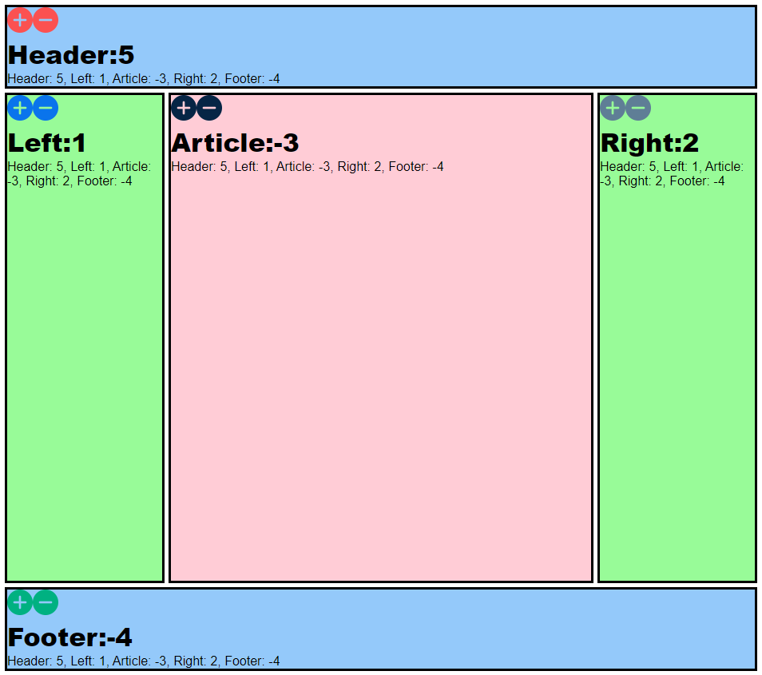

# Holy Grail with Redis
 

## Description 
This is an example of the clasic Holy Grail Web Design/Application using react to Update state and Redis as the database.

## Purpose 
This was done as an assignment in the MIT course - Full Stack Development with Mern

---------

## Technologies Used 
- HTML
- CSS
- Javascript

---------

## Installation 
- Clone this repository to your local machine
- Install Docker if not already installed https://docs.docker.com/desktop/
- Open a command line on your computer and run the command cd path-to-project-root (this should be the actual directory where the repository is located on your local machine)
- Within the same command-line window, run npm install
- Once the command completes successfully, run docker run -p 6379:6379 --name some-redis -d redis
- Once the command completes successfully, run nodemon index.js
- Open your browser of choice and browse to http://localhost:3000/

## How to Run 
- When the page is loaded in your browser, you will notice all entries are set to count 0
- To increase/decrease the count of a section, click on the + or - button in that section
- That sections count will increase in all sections

---------

## Files 
  - **/public/icons/.png** - Various + and - buttons used in application
  - **/public/article.js** - Article section of the application
  - **/public/footer.js** - Footer section of the application
  - **/public/header.js** - Header section of the application
  - **/public/index_no_db.js** - No Redis Database React code
  - **/public/index.js** - Redis Database React code
  - **/public/index.html** - Html page that contains the call to initialize React/Babel/SuperAgent
  - **/public/left.js** - Left section of the application
  - **/public/right.js** - Right section of the application
  - **/public/section.css** - Stylesheet file that positions objects, controls text, colors, and layo
  - **/src/index.js** - Contains the API calls and starts the HTTP Server

---------

## Contributing 
Pull requests are welcome. For major changes, please open an issue first to discuss what you would like to change.

## License
[The MIT License (MIT)](https://github.com/slumpbuster/HolyGrailwRedis/blob/main/LICENSE)

